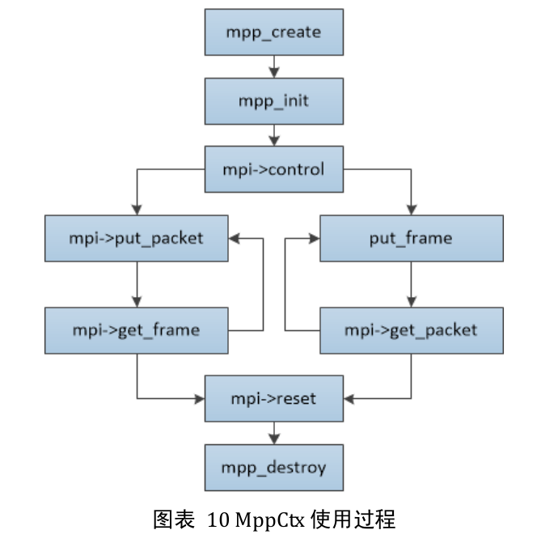

# 基于`Live555`网络推拉流技术的介绍

## Abstract

本文主要是对`live555`的开发网络推拉流代码流程进行记录，以及在进行推拉流开发时对遇到的一些问题进行记录。同时针对这些问题进行了一些源码的阅读以及分析。

本项目主要目标是通过`RK3588`来实现基于硬件编解码的网络推拉流服务。该服务分为两部分，一部分是网络推流，对应的另一部分是网络拉流。

推流主要流程是通过`RK3588`捕获图像后，交由硬件进行编码，并将编码后的数据通过`live555`进行广播或者单播到网络。可以使其他网络机器在较低延迟的情况下进行实时视频获取

拉流则流程与推流相反，通过单播或者多播的方式从网络获取数据报文，并通过硬件进行解码成对应的图像帧并显示。

## 1. 服务端

`Live555`服务端主要由分三部分：

1. 捕获视频/图片的模块
2. 视频编码模块
3. 码流发送模块

### 1.1 视频捕获模块

该模块主要目的是获取来自设备的图像数据，目前我使用了两种方式:分别是基于`Opencv`以及`v4l2`

#### 1.1.1 `Opencv`进行视频捕获

使用`Opencv`进行视频捕获只需要遵循以下流程即可

```
----------------	 --------		 --------     --------	   -----------------
| VideoCapture | --> | open | -->    | read | --> | data | --> | do somethings |
----------------	 --------		 --------	  --------	   -----------------
										^					 			|
										|					 			|
										|					 			V
										--------------------------------- 
```

1. 实例化`VideoCapture`
2. 调用`open`打开驱动`/dev/video*`
3.  从驱动里读取数据
4. 消费数据
5. 重复第3步

该流程很简单，是`opencv`读取数据的标准流程，此处不做过多介绍

#### 1.1.2 `v4l2`视频读取

`v4l2`是`linux`内核中关于视频设备驱动的框架，主要通过`ioctl(I/O control)`与驱动进行交互。
`ioctl(int fd,unsigned long int cmd，param,...)`函数参数主要由三个部分组成：第一部分为文件句柄，通过这个唯一句柄识别驱动，第二部分为交互指令，该指令通知设备进行什么操作，第三部分则是传入或者传出参数
`sys/ioctl.h`主要通过第二个参数的协议来与IO设备进行交互指令发送，已使驱动完成特定功能，在用户空间通过调用`ioctl`,会进入内核调用`sys_ioctl`,然后内核通过指令发送给驱动进行特定的操作。

因此使用`v4l2`对摄像头驱动或者`HDMI`输入驱动都可以，通过命令交互的方式拿到对应的数据。
主要流程如下：

1. `open`函数打开设备驱动获得文件句柄`fd`
2. `VIDIOC_S_FMT`设置采集格式，输入是`v4l2_format`格式的数据，对于设备采集的数据类型可以通过:`v4l2-ctl -d /dev/video* -V -D `进行查询驱动所支持的数据格式。对于可捕获的格式主要分两种：`V4L2_BUF_TYPE_VIDEO_CAPTURE_MPLANE`以及`V4L2_BUF_TYPE_VIDEO_CAPTURE`，这两种类别在后面分别对应不同的处理方法，但大致是相同的。主要区别在于`multiplane`相比较与`CAPTURE`会返回多个`plane`，需要迭代去处理,而`CAPTURE`可以直接获取一帧图像。`RK3588`的`HDMI`输入只支持`multiplane`，因此下面以`multiplane`进行介绍
3. 在第2步设置采集格式后，可以通过`VIDIOC_G_FMT`进行查询采集格式是否设置正确，该指令输入和输出均是`v4l2_format`。
4. 申请缓冲队列，`VIDIOC_REQBUFS`通过该指令可以在内核开启对应个数的缓冲区，设备驱动会将数据写入该部分，利用程序对这块进行读写既可以获得视频数据。这里memory有多种方式，采用最多的是`V4L2_MEMORY_MMAP`内存映射方式，即将内核空间的区域映射到用户空间。同时还注意`V4L2_MEMORY_DMABUF`(有待补充)
5. 申请缓存之后，同时要注意，我们的设备捕获的是`multiplane`的模式，一帧数据会返回多个`plane`(具体有多少个`plane`在第3步进行采集格式查询的时候会返回)，因此我们需要创建一块用户空间的内存区域，其中包含了和缓存队列元素个数一致的用户内存区域，用来对缓存队列进行内存映射。因为是`multiplane`模式，所以我们定义一个`v4l2_plane`的数组，同时也定义了一个和`v4l2_plane`一一对应的用户空间地址`mmpaddr`,见：`struct image_buffer_with_plane`，并将`plane`信息与`v4l2_buffer`进行绑定,然后使用`VIDIOC_QUERYBUF`查询缓存信息，然后使用`mmap`函数根据缓存查询出来的`plane`大小和偏移，**逐一映射到用户空间**。缓存队列的长度同时也决定了`struct image_buffer_with_plane`的数组长度。
6. 在第5步映射完毕后，需要将查询到的`plane`进行入队,`VIDIOC_QBUF`指令，这样驱动在获取到数据后，会将数据写入该队列，等待消费，在我们将缓存出队消费掉后进行压队。以达到循环使用的过程

```
				                     data
				                      |
				   ---------------------------------------
				   |                                     |
				  pop                                 	push
				   ^                                     |
				   |                                     V
				-------    -------    -------         -------
				| ele | -- | ele | -- | ... |         | ele |
				-------    -------    -------         -------  

```
7. `VIDIOC_STREAMON` 开始进行数据获取
8. 使用`VIDIOC_DQBUF`指令进行出队操作，主要输入输出也是`v4l2_buffer`,出队后，根据`v4l2_buffer`中的`index`确定是属于队列的第几个元素，与第5步中申请的`image_buffer_with_plane`索引一致。**遍历`plane`，逐个`plane`进行拷出**
9. 出队后的数据，再次放回队列`VIDIOC_QBUF`
10. `VIDIOC_STREAMOFF`关闭数据获取
11. 取消映射`munmap`
12. `close`设备句柄


```   html
                                                                                
                      ---------------------                                     
                      |    v4l2_format    |                                     
                      ---------------------                                     
                        |            ^                                          
                        |            |                                          
                        |            |                                          
                        V            |                                          
--------     ----------------     ----------------     -------------------     --------------------
| open | --> |  set_format  | --> |  get_format  | --> | request_buffer  | --> |   query_buffer   |
--------     ----------------     ----------------     -------------------     --------------------
                                                                                          |
                                                                                          V
                                                                                  ----------------           --------------------      ---------------
                                                                                  |   planes[n]  |  -mmap->  |   mmpaddress[n]  |  --> |  read data  |  
                                                                                  ----------------           --------------------      ---------------
                                                                                  |   planes[n]  |  -mmap->  |   mmpaddress[n]  |  --> |  read data  |  
                                                                 -------------->  |---------------           |-------------------      ---------------
                                                                 |                |   planes[n]  |  -mmap->  |   mmpaddress[n]  |  --> |  read data  |  
                                                                 |                |---------------           |-------------------      ---------------
                                                                 |                |   planes[n]  |  -mmap->  |   mmpaddress[n]  |  --> |  read data  |  
                                                                 |                ----------------           --------------------      ---------------
                                                                 |                        |          
                                                        ----------------                  V
                                                        | pop_out_data |          ------------------
                                                        ----------------          |  push_in_queue |
                                                                 |                ------------------
                                                                 |                        |
                                                                 |                  ---------------
                                                                 |                  |  stream on  |
                                                                 |                  ---------------
                                                                 |                        |
                                                                 |                        |
                                                                 --------------------------
                                                                                          |
                                                                                    ----------------
                                                                                    |  stream off  |
                                                                                    ----------------
                                                                                          |
                                                                                      ---------
                                                                                      | close |
                                                                                      ---------


```

### 1.2 视频编码模块

`RK3588`内置了编解码硬件，通过[rockchip_mpp](https://github.com/rockchip-linux/mpp)项目向上提供API，供用户进行调用。官方文档可以参考[MPP_开发文档_v0.3.pdf](https://opensource.rock-chips.com/images/b/bf/MPP_%E5%BC%80%E5%8F%91%E5%8F%82%E8%80%83_v0.3.pdf)

官方项目里面对于视频编码的代码有两个测试文件[mpi_enc_test.c](https://github.com/rockchip-linux/mpp/blob/ed377c99a733e2cdbcc457a6aa3f0fcd438a9dff/test/mpi_enc_test.c)，[mpi_enc_mt_test.cpp](https://github.com/rockchip-linux/mpp/blob/ed377c99a733e2cdbcc457a6aa3f0fcd438a9dff/test/mpi_enc_mt_test.cpp)分别对应单线程编码和多线程编码

这里对官方给的测试样例不做过多的赘述，在这里主要对本项目的编码模块进行一个总体概括，视频编码主要分为三部分：编码器初始化部分，数据帧封装部分，编码部分。

整体流程如下如所示：



#### 1.2.1 编码器初始化

##### 1.2.1.1 编码器上下文创建和初始化

编码器初始化主要是创建两个对象`mppCtx`以及`mppApi`,后续所有硬件编解码操作都由这两个对象进行控制。

```c++
res = mpp_create(&mppCtx,&mppApi);
// 将mppCtx初始化成编码h264码流模式
res = mpp_init(mppCtx,MPP_CTX_ENC,MPP_VIDEO_CodingAVC);
```

对于`mpp_init`的第三个类型参数可以参考:[`mpp/inc/rk_type.h`](https://github.com/rockchip-linux/mpp/blob/ed377c99a733e2cdbcc457a6aa3f0fcd438a9dff/inc/rk_type.h#L91)

```c++
typedef enum {
    MPP_VIDEO_CodingUnused,             /**< Value when coding is N/A */
    MPP_VIDEO_CodingAutoDetect,         /**< Autodetection of coding type */
    MPP_VIDEO_CodingMPEG2,              /**< AKA: H.262 */
    MPP_VIDEO_CodingH263,               /**< H.263 */
    MPP_VIDEO_CodingMPEG4,              /**< MPEG-4 */
    MPP_VIDEO_CodingWMV,                /**< Windows Media Video (WMV1,WMV2,WMV3)*/
    MPP_VIDEO_CodingRV,                 /**< all versions of Real Video */
    MPP_VIDEO_CodingAVC,                /**< H.264/AVC */
    MPP_VIDEO_CodingMJPEG,              /**< Motion JPEG */
    MPP_VIDEO_CodingVP8,                /**< VP8 */
    MPP_VIDEO_CodingVP9,                /**< VP9 */
    MPP_VIDEO_CodingVC1 = 0x01000000,   /**< Windows Media Video (WMV1,WMV2,WMV3)*/
    MPP_VIDEO_CodingFLV1,               /**< Sorenson H.263 */
    MPP_VIDEO_CodingDIVX3,              /**< DIVX3 */
    MPP_VIDEO_CodingVP6,
    MPP_VIDEO_CodingHEVC,               /**< H.265/HEVC */
    MPP_VIDEO_CodingAVSPLUS,            /**< AVS+ */
    MPP_VIDEO_CodingAVS,                /**< AVS profile=0x20 */
    MPP_VIDEO_CodingAVS2,               /**< AVS2 */
    MPP_VIDEO_CodingAV1,                /**< av1 */
    MPP_VIDEO_CodingKhronosExtensions = 0x6F000000, /**< Reserved region for introducing Khronos Standard Extensions */
    MPP_VIDEO_CodingVendorStartUnused = 0x7F000000, /**< Reserved region for introducing Vendor Extensions */
    MPP_VIDEO_CodingMax = 0x7FFFFFFF
} MppCodingType;
```

##### 1.2.1.2 编码器参数设置

编码器的参数设置主要用过`mpp_enc_cfg_set_*`函数来实现，`mpp`提供了这一系列的传值函数。在[`rk_venc_cfg.h`](https://github.com/rockchip-linux/mpp/blob/ed377c99a733e2cdbcc457a6aa3f0fcd438a9dff/inc/rk_venc_cfg.h#L32)文件里定义了编码器配置文件的`get/set`函数，并且分别针对有符号32位整数，无符号32位整数，有符号64位整数，无符号64位整数进行了重载。

```c++
MPP_RET mpp_enc_cfg_set_s32(MppEncCfg cfg, const char *name, RK_S32 val);
MPP_RET mpp_enc_cfg_set_u32(MppEncCfg cfg, const char *name, RK_U32 val);
MPP_RET mpp_enc_cfg_set_s64(MppEncCfg cfg, const char *name, RK_S64 val);
MPP_RET mpp_enc_cfg_set_u64(MppEncCfg cfg, const char *name, RK_U64 val);
MPP_RET mpp_enc_cfg_set_ptr(MppEncCfg cfg, const char *name, void *val);
MPP_RET mpp_enc_cfg_set_st(MppEncCfg cfg, const char *name, void *val);

MPP_RET mpp_enc_cfg_get_s32(MppEncCfg cfg, const char *name, RK_S32 *val);
MPP_RET mpp_enc_cfg_get_u32(MppEncCfg cfg, const char *name, RK_U32 *val);
MPP_RET mpp_enc_cfg_get_s64(MppEncCfg cfg, const char *name, RK_S64 *val);
MPP_RET mpp_enc_cfg_get_u64(MppEncCfg cfg, const char *name, RK_U64 *val);
MPP_RET mpp_enc_cfg_get_ptr(MppEncCfg cfg, const char *name, void **val);
MPP_RET mpp_enc_cfg_get_st(MppEncCfg cfg, const char *name, void *val);
```

在参数设置的过程中，对编码器主要需要设置如下几个类别的参数：

1. 编码器输入图像长和宽
2. 编码器输入图像关于16字节对齐的长和宽(`hor_stride,ver_stride`)
3. 编码器输入图像的类型，在RK3588中目前仅支持`BGR`和`NV12`格式的图片进行编码
4. 视频输入输出帧率(`fps`)
5. 编码器输出关键帧模式，见`rc:gop`(Group of Pirture)
6. 编码器丢帧策略
7. 编码器的码率模式以及码率
   1. 恒定码率(`CBR,Constant Bit Rate`)：使用`rc:bps_target`指定
   2. 可变码率(`VBR,Variable Bit Rate`)：使用`rc:bps_max,rc_bps_min`指定
8. 编码输出帧的切片模式
9. `H264`的编码设置

```c++
mpp_enc_cfg_set_s32(cfg, "prep:width", width); 						// 图像的宽
mpp_enc_cfg_set_s32(cfg, "prep:height", height);					// 图像的高
mpp_enc_cfg_set_s32(cfg, "prep:hor_stride", hor_stride);			// 水平步长，关于16字节对齐
mpp_enc_cfg_set_s32(cfg, "prep:ver_stride", ver_stride);			// 垂直步长，关于16字节对齐
mpp_enc_cfg_set_s32(cfg, "prep:format", MPP_FMT_YUV420P);			// 图片格式类型

mpp_enc_cfg_set_s32(cfg, "rc:quality", MPP_ENC_RC_QUALITY_BEST);	// 编码质量
mpp_enc_cfg_set_s32(cfg, "rc:mode", MPP_ENC_RC_MODE_VBR);			// 编码码率模式

/* fix input / output frame rate */
mpp_enc_cfg_set_s32(cfg, "rc:fps_in_flex", 0);						// 输入帧率标识位
mpp_enc_cfg_set_s32(cfg, "rc:fps_in_num", 60);						// 输入帧率分子
mpp_enc_cfg_set_s32(cfg, "rc:fps_in_denorm",1);						// 输入帧率分母
mpp_enc_cfg_set_s32(cfg, "rc:fps_out_flex", 0);						// 输出帧率标识位
mpp_enc_cfg_set_s32(cfg, "rc:fps_out_num", 60);						// 输出帧率分子
mpp_enc_cfg_set_s32(cfg, "rc:fps_out_denorm", 1);					// 输出帧率分母

/* all frame are I */
// mpp_enc_cfg_set_s32(cfg, "rc:gop", 2);							// I帧输出模式
/* drop frame or not when bitrate overflow */
mpp_enc_cfg_set_u32(cfg, "rc:drop_mode", MPP_ENC_RC_DROP_FRM_DISABLED);
mpp_enc_cfg_set_u32(cfg, "rc:drop_thd", 20);        				/* 20% of max bps */
mpp_enc_cfg_set_u32(cfg, "rc:drop_gap", 1);        					/* Do not continuous drop frame */

/* setup bitrate for different rc_mode */
mpp_enc_cfg_set_s32(cfg, "rc:bps_max", 100*1024*1024 * 17 / 16);	// 最大码率
mpp_enc_cfg_set_s32(cfg, "rc:bps_min", 100*1024*1024 * 15 / 16);	// 最小码率
	
mpp_enc_cfg_set_s32(cfg,"split:mode", MPP_ENC_SPLIT_NONE);			// 分片模式
// mpp_enc_cfg_set_s32(cfg,"split_arg", 0);
// mpp_enc_cfg_set_s32(cfg,"split_out", 0);

mpp_enc_cfg_set_s32(cfg, "h264:profile", 100);						// SPS中的profile_idc参数
mpp_enc_cfg_set_s32(cfg, "h264:level", 42);							// SPS中level_idc参数
mpp_enc_cfg_set_s32(cfg, "h264:cabac_en", 1);						// 熵编码
mpp_enc_cfg_set_s32(cfg, "h264:cabac_idc", 0);						// cabac_init_idc参数
mpp_enc_cfg_set_s32(cfg, "h264:trans8x8", 1);						// 8x8变换使能标志位
```

##### <a id="getHead">1.2.1.3 头信息获取</a>

在配置参数到`mppCfg`对象之后，通过`MPP_ENC_SET_CFG`设置给`mppCtx`上下文。在设置成功后可以通过`MPP_ENC_GET_HDR_SYNC`来获取编码器的`PPS,SPS`信息，

1. `SPS(sequence parameter set)`, 序列参数集(解码相关信息，档次级别、分别率、某档次中编码工具开关标识和涉及的参数、时域可分级信息等)，码流开头 `{00,00,00,01,67`
2. `PPS(picture parameter set)`, 图像参数集（一幅图像所用的公共参数，一幅图像中所有`SPS`应用同一个`PPS`,初始图像控制信息，初始化参数、分块信息），码流开头 `{00,00,00,01,68}`

一般情况下这两个信息会出现在码流开头，用于告诉解码器图像宽高档次等信息。这个信息对于做实时直播而言，由于不确定用户会什么时候接入，因此需要一直存在于码流之中。所以在后面我们对于非关键帧都在开头设置了`PPS,SPS`信息，这部分会在码流发送模块进行讲解。

#### 1.2.2 图像编码

我们在获得图像数据后，需要将数据提交给编码器进行编码。在`mpp`中我们需要将数据创建成硬件能识别的`MppFrame`帧。本部分主要目的就是介绍如何将内存中的视频信息拷贝至硬件缓存部分。

`mpp`主要通过两种方式进行帧的提交：直接提交，提交给缓存池

##### 1.2.2.1 直接提交

直接提交主要流程如下：

```
-----------          -------------     ------------		---------------             ----------------- 
| rgb/yuv |          | mppBuffer | --> | mppFrame |	--> |   Encoder   | -->encode-->|   mppPacket   | 
-----------          -------------     ------------		---------------             ----------------- 
    |                       ^ 
    |                       | 
    ------------copy--------- 

```

更具图像大小创建一块`mppBuffer`，该对象主要由四个关键成员变量：`(fd句柄，ptr数据指针，size数据大小，index索引)`。将图像数据直接拷贝到`ptr`指向的空间，并同时设置空间的大小`size`

然后创建一块`mppFrame`，将该块`mppBuffer`与`mppFrame`进行关联`(mpp_frame_set_buffer)`，同时设置帧信息（宽、高、水平步长、垂直步长，图的格式，是否最后一帧等）

然后创建一块用于输出的`mppPacket`对象，该块对象同样需要关联一块对应的缓存。用于保存编码器的输出。

将`mppFrame`送入编码器进行编码然后就可以得到`mppPacket`

该方式在官方测试样例`mpp_enc_test.c`里有使用。

##### 1.2.2.2 使用缓存池

官方文档里面提供了两种缓存池：`internal/external`模式。**缓存池主要是使用在进行解码的时候**，为了避免内存泄露，提高解码效率官方文档是优先推荐了这种使用方式。使用缓存池进行解码在客户端部分会进行详解。

1. `internal`模式，主要让编码器进行`mppBuffer`的自行流转
2. `external`模式，准许提交来自外部的缓存数据

```
/*
 * mpp buffer group support two work flow mode:
 *
 * normal flow: all buffer are generated by MPP
 *              under this mode, buffer pool is maintained internally
 *
 *              typical call flow:
 *
 *              mpp_buffer_group_get()          return A
 *              mpp_buffer_get(A)               return a    ref +1 -> used
 *              mpp_buffer_inc_ref(a)                       ref +1
 *              mpp_buffer_put(a)                           ref -1
 *              mpp_buffer_put(a)                           ref -1 -> unused
 *              mpp_buffer_group_put(A)
 *
 * commit flow: all buffer are commited out of MPP
 *              under this mode, buffers is commit by external api.
 *              normally MPP only use it but not generate it.
 *
 *              typical call flow:
 *
 *              ==== external allocator ====
 *              mpp_buffer_group_get()          return A
 *              mpp_buffer_commit(A, x)
 *              mpp_buffer_commit(A, y)
 *
 *              ======= internal user ======
 *              mpp_buffer_get(A)               return a
 *              mpp_buffer_get(A)               return b
 *              mpp_buffer_put(a)
 *              mpp_buffer_put(b)
 *
 *              ==== external allocator ====
 *              mpp_buffer_group_put(A)
 *
 *              NOTE: commit interface required group handle to record group information
 */
```

因此在编码的时候，我们同样可以将数据提交给`external`的缓存池，然后经过该缓存池来封装`mppFrame`

主要流程如下：

```
-----------          -------------    -----------------             -----------------           ----------         ------------     -----------		-------------
| rgb/yuv |          | mppbuffer | -->| mppBufferInfo | -->commit-->| mppbufferPool | -->get--> | buffer | ------> | mppFrame | --> | Encoder | --> | mppPacket |
-----------          -------------    -----------------             -----------------           ----------         ------------     -----------		-------------
    |                                      ^                                                        |                    ^
    |                                      |                                                        |                    |
    ------------------copy------------------                                                        -mpp_frame_set_buffer-
```

1. 创建一块`mppBuffer`，并绑定到`mppBufferInfo`的`ptr`以及`fd`上
2. 将其提交给`mppBufferPool`
3. 重新从缓存池中获取`mppBuffer`
4. 然后将这块缓存绑定到`mppFrame`上
5. 最后送入编码器进行编码，得到`mppPacket`

*在进行编码时可以直接使用直接提 交的方式，也可以使用外部缓存池的方式进行编码，但是对于解码而言，官方给出的三种内存交互场景是优先推荐使用缓存池的。*


##### 1.2.2.3 编码
官方文档里面提供了三种编码方式
1. `encode`函数，直接输入图像获取码流，（暂未实现）
1. `encode_put_frame/encode_get_packet`，编码拆分成送图，拿码流两部分
1. `poll/dequeue/enqueue`，队列任务方式

前两种为简单款的编码流程，但是要注意的是`encode_*`函数是阻塞式函数，一定程度上会影响软硬件的整体并行效率

使用`encode_*`函数主要流程如下：

1. 调用`encode_put_frame`送入`mppFrame`
2. 调用`encode_get_packet`获取`mppPacket`
3. 判断`mppPacket`信息是否为空，不为空进入发送模块

*拷贝与零拷贝输入
编码器的输入不支持 CPU 分配的空间，如果需要支持编码 CPU 分配的地址，需要分配 `MppBuffer`
并把数据拷贝进去，这样做会很大程度影响效率。编码器更喜欢 `dmabuf/ion/drm` 内存形式的输入，
这样可以实现零拷贝的编码，额外的系统开销最小。*

使用`poll/dequeue/enqueue`可以指定使用阻塞模式或者非阻塞模式。

同时也可以在初始化上下文`(mppCtx)`的时候可以指定任务是同步模式还是异步模式，异步模式会直接返回控制权，但并不能确保在执行任务的时候任务是否已经完成。见[`mpp_task.h`](https://github.com/rockchip-linux/mpp/blob/ed377c99a733e2cdbcc457a6aa3f0fcd438a9dff/inc/mpp_task.h)

```c++
//1. set frame
res = mppApi->poll(mppCtx, MPP_PORT_INPUT, MPP_POLL_BLOCK); 		// 提交一个阻塞的输入任务
res = mppApi->dequeue(mppCtx, MPP_PORT_INPUT, &task);				// 出队一个任务
res = mpp_task_meta_set_packet(task,KEY_OUTPUT_PACKET,mppPacket);	// 设置输出packet
res = mpp_task_meta_set_frame(task, KEY_INPUT_FRAME, mppframe);		// 设置输入frame
res = mppApi->enqueue(mppCtx, MPP_PORT_INPUT, task);				// 任务压入队列

//2. get packet
res = mppApi->poll(mppCtx, MPP_PORT_OUTPUT, MPP_POLL_BLOCK);		// 提交一个阻塞的输出任务
res = mppApi->dequeue(mppCtx, MPP_PORT_OUTPUT, &task);				// 出队一个任务
res = mpp_task_meta_get_packet(task, KEY_OUTPUT_PACKET, &mppPacket);// 获取输出packet
res = mppApi->enqueue(mppCtx, MPP_PORT_OUTPUT, task);				// 任务压入队列

/*3. 判断 mppPacket 是否为空，不为空进行发送模块*/
```

#### 1.2.3  图片拷贝

`RockChip`支持两种图片格式的编码：`YUV/BGR`，因此在我们将图片数据采用内存拷贝的方式提交给硬件的时候`(mppFrame)`，分别对应了不同的方式。主要要注意的点就是`mpp`硬件编码时是对16位对齐。也就是每次读取16位的数据到硬件中。所以我们的图片长宽都需要关于16位对齐。

##### 1.2.3.1 `YUV`图像拷贝

`YUV`数据格式分为三部分：分别是亮度`Y`和色度`UV`。`YUV`相对于传统`RGB`能压缩一半的存储大小。

以 $1920 \times 1080 \times 3$的`BGR`图像为例，将其转换成`YUV`图像后，图像大小将变为$ 1920 \times 1080 $的`Y`分量，$ {1920 \over 2} \times {1080 \over 2}$ 的`U`分量以及$ {1920 \over 2} \times {1080 \over 2}$ 的`V`分量。

总共是$ 1920 \times {1080 \times 3 \over 2} \times 1$ 的图像

**注：其中`UV`的交叉存储和分别存储对应了`YUV420SP`以及`YUV420P`这两种格式。这两种不同的格式对应的拷贝方式也不一样**

`NV12/NV21`属于`YUV420SP`，`NV12`是`UV`交叉，而`NV21`是`VU`交叉

`YU12/YV12` 属于`YUV420P`，`YU12`是`YUV`顺序存储，而`YV12`是`YVU`顺序

这两种图像排列方式如下图所示：

```
-------------------------------------           -------------------------------------  
|                                   |           |                                   |
|                                   |           |                                   |
|                 Y                 |           |                 Y                 |
|              (YUV420P)            |           |             (YUV420SP)            |
|                                   |           |                                   |
|                                   |           |                                   |
-------------------------------------           -------------------------------------
|                 U                 |           |U|V|U|V|U|V|U|V|...				|
|-----------------------------------|           |              ...                  |
|                 V                 |           |                                   |
-------------------------------------           -------------------------------------
```

在`Mpp`编码中因为要关于16字节对齐：

```c++
#define MPP_ALIGN(x, a)         (((x)+(a)-1)&~((a)-1)) 			/*关于参数a对齐的宏函数*/
```

所以在例子$ 1920 \times 1620 $ 的`YUV`图像中，宽度不变，同时高度关于16字节对齐成$1632$，因此整体`YUV420P`图像格式的布局如下：

```
YUV图像分量的分布为：wxh的亮度Y，w/2 x h/2的U，w/2 x h/2的V，因为YUV420SP中UV是分开存储，所以UV各占wxh/4
---------------------w(1920)--------------------------- 
|                            						  |
|                            						  |
|                            						  |
|             			Y              				h(1080)
|                            						  |
|                            						  |
|                            						  |
------------------------------------------------------- 
|                            						  |
|             			gap    						  | 8
------------------------------ ------------------------- 
|                            						  |
|              			 U             			   h/4(270)
|                            						  |
------------------------------------------------------- 
|             			gap            				  | 2
------------------------------ ------------------------- 
|                            						  |
|              			 V             				h/4(270)
|                            						  |
------------------------------------------------------- 
|             			gap            				  | 2
------------------------------------------------------- 

```

`YUV`图像数据拷贝函数如下：

```c++
MPP_RET read_frame(cv::Mat & cvframe,void * ptr){
    RK_U32 row = 0;
    RK_U32 read_size = 0;
    RK_U8 *buf_y = (RK_U8 *)ptr;
    RK_U8 *buf_u = buf_y + hor_stride * ver_stride; // NOTE: u分量起始指针
    RK_U8 *buf_v = buf_u + hor_stride * ver_stride / 4; // NOTE: v分量起始指针
    // buf_y = cvframe.data;
    // copy Y
    for (row = 0; row < height; row++) {
        memcpy(buf_y + row * hor_stride,cvframe.datastart + read_size,width);
        read_size += width;
    }
	// copy U
    for (row = 0; row < height / 2; row++) {
        memcpy(buf_u + row * hor_stride/2,cvframe.datastart + read_size ,width/2);
        read_size += width/2;
    }
	// copy V
    for (row = 0; row < height / 2; row++) {
        memcpy(buf_v + row * hor_stride/2,cvframe.datastart + read_size ,width/2);
        read_size += width/2;
    }
    return MPP_OK;
}
```


##### 1.2.3.2 `BGR`图像拷贝

对于`BGR`图像，`mpp`的处理方式更加直接，不需要做通道分离，只需要按行拷入即可，同样需要注意考入的时候款和高需要关于16字节对齐。

因为`BGR`是三通道数据，因此需要注意的是拷贝的时候实际水平步长应该是宽的3倍并关于16位对齐。也就是$ \lceil 1920 \times 3 \rceil$

```
-------------w(1920)-----------------------w(1920)-----------------------w(1920)----------
|r|g|b|r|g|b|                |                              |                            |
|                            |                              |                            |
|                            |                              |                            |
|             Y              h(1080)                        |                            |
|                            |                              |                            |
|                            |                              |                            |
|                            |                              |                            |
-------------------------------------------w(1920)-----------------------w(1920)----------
|                            |                              |                            |
|             gap            | 8                            |                            |
-------------------------------------------w(1920)-----------------------w(1920)----------


```

#### 1.2.4  码流封装

在本项目中，发送模块分了两种方式，分别是`FFMPEG，LIVE555`格式，使用`FFMPEG`格式需要将数据封装成它需要的`AvPacket`。而使用`live555`则不需要，可以直接送入发送队列。

##### 1.2.4.1 FFMPEG码流封装

这里创建一个`AvPacket`，这里有五个参数需要设置:`[data,size,buf,pts,dts]`

将`mppPacket`的`data`部分赋值给`AvPacket.data`，同时设置这块数据包的大小，

然后创建一块关联`mppPacket`的`avBuffer`，并赋值给`AvPacket`

最后设置编码时戳。这块代码参考了魔改版本的[`FFMPEG`](https://github.com/jjm2473/ffmpeg-rk/tree/enc)

该版本中实现了一个`rkmpp`版本的编解码器[`rkmppenc`](https://github.com/jjm2473/ffmpeg-rk/blob/enc/libavcodec/rkmppenc.c),[`rkmppdec.c`](https://github.com/jjm2473/ffmpeg-rk/blob/enc/libavcodec/rkmppdec.c)

```c++
typedef struct {
    MppPacket packet;
    AVBufferRef *encoder_ref;
} RKMPPPacketContext;

RKMPPPacketContext *pkt_ctx = (RKMPPPacketContext *)av_mallocz(sizeof(*pkt_ctx));
pkt_ctx->packet = mppPacket;
int keyframe = 0;
// TODO: outside need fd from mppbuffer?
packet->data = (uint8_t *)mpp_packet_get_data(mppPacket);
packet->size = mpp_packet_get_length(mppPacket);
packet->buf = av_buffer_create((uint8_t*)packet->data, packet->size,
    rkmpp_release_packet, pkt_ctx, AV_BUFFER_FLAG_READONLY);
packet->pts = mpp_packet_get_pts(mppPacket);
packet->dts = mpp_packet_get_dts(mppPacket);

if (packet->pts <= 0)
    packet->pts = packet->dts;
if (packet->dts <= 0)
    packet->dts = packet->pts;
meta = mpp_packet_get_meta(mppPacket);
if (meta)
    mpp_meta_get_s32(meta, KEY_OUTPUT_INTRA, &keyframe);
if (keyframe){
    packet->flags |= AV_PKT_FLAG_KEY;
}
```

##### 1.2.4.2 `LIVE555`码流封装

对于`LIVE555`而言，不需要进行封装可以直接进行发送。

## 1.3 码流发送模块

码流发送模块同样分为两种方式：`FFMPEG`模式发送以及`LIVE555`进行发送

在码流发送前，我们需要注意到，在章节[1.2.1.3 头信息获取](#getHead)中我们介绍了一些关于`SPS，PPS`信息的特性。

解码器在获取这两个信息后才能正确初始化进行解码，但因为对于直播视频流而言，我们并不知道什么时候用户会介入，所以需要对每帧帧头插入`PPS，SPS`信息。

在`H264`码流中，视频帧主要分三种帧：I帧，P帧，B帧。这三种帧分别在解码的过程中起不同的作用，见[Ref:8](#refl)。

`I`帧：视频关键帧，用于视频帧同步使用，该帧包含了完整的图像信息。压缩率非常低。解码的时候不需要其他帧本帧就能直接还原成完整图像，同时该帧也是`P`帧`B`帧的参考帧。

`P帧`：前向参考帧，用于记录相对于前面的`I`帧或者`P`帧所产生的变化，解码时需要重叠到关键帧之前的所有差异才能重构当前画面。

`B`帧：双向参考帧，用于基于本帧和前后帧(`P`帧或者`I`帧)的差别，解码时需要前后帧才能进行解码，压缩率也是最高的。

`GOP，Group of Picture`：图像组，两个`I`帧之间的帧数称为图像组。

码流的固定起始码是：`{00,00,00,01}`，这个表示上一帧的结束以及本帧的数据开始。而对于`SPS`信息的开头码为：`{00 00 00 01 67}`，同样的`PPS`信息的开头码为：`{00 00 00 01 68}`。`P`帧数据的开头则是`{00 00 00 01 41}`。关键帧`I`帧的数据格式则是有可能会包含了自定义信息`{00 00 00 01 06}`，以及一块`{00 00 00 01 65}`的关键帧数据。


### 1.3.1 `FFMPEG`发送模式

对于封装好的AvPacket可以直接调用`av_interleaved_write_frame`函数进行发送，这里不做过多的赘述，详情可以参考代码[`rk_ffmpeg`](https://github.com/EZreal-zhangxing/rk_ffmpeg)

### 1.3.2 `LIVE555`发送

[`live555`](http://live555.com/)是一种基于`socket`技术的码流推拉流框架，是一种轻量级的直播推拉流技术，该框架定义了一套完整的广播或者单播推流技术。

`live555`目录结构如下所示：

```bash
├── BasicUsageEnvironment		// live555基本环境核心类以及配置组件所在目录
│   └── include
├── groupsock					// 网络通讯相关，包含了组播定义，以及网络流的发送喜爱嗯官
│   └── include
├── hlsProxy					// hls相关
├── liveMedia					// 媒体类相关，定义了用来处理各种类型数据源以及发送数据元相关的媒体类文件，例如文件,H265,H264,H261,H263,AC3等音频格式
│   └── include
├── mediaServer					// 媒体服务器类
├── proxyServer					// 代理服务器样例
├── testProgs					// 测试程序样例
├── UsageEnvironment			// live555环境核心类
│   └── include
└── WindowsAudioInputDevice		// 音频相关

```

`Live555`的发送主要采用文件发送的形式，将音视频切片文件（例如，`mp4,avi,ts,flv`）通过自定义的各种数据源(`*Source`)进行读取后，通过`*Sink`进行数据处理，然后交由底层的`Socket`转发出去（`test*VideoStreamer`）或者转换成对应的文件（`test*ToTransportStream`）。

在`liveMedia`文件夹中包含了各种数据类型的处理函数，例如：

1. `ByteStreamFileSource.hh` ，字节文件流数据源
2.  `MP3FileSource.hh`，MP3文件数据源
3. `ADTSAudioFileSource.hh` ADTS音频文件数据源

在`testProgs`文件夹中给出了码流接受和发送的相关测试代码。这里主要从单播，组播方面进行代码分析。用来讲解`Live555`的发送原理

#### 1.3.2.1 `Live555`单播

主要参见`testProgs/testOnDemandRTSPServer.cpp,testProgs/testH264VideoToTransportStream.cpp`文件。

`testProgs/testH264VideoToTransportStream.cpp`主要功能是将`h264`文件读取后转换成`ts`文件。该文件格式转换流程和码流的发送是有一定的相似之处，其中在文件读取创建数据源方面是类似的。

`testProgs/testOnDemandRTSPServer.cpp`则包含了常见的各种文件的单播过程。该文件的`main`函数主要功能如下：

##### 1. `TaskScheduler，UsageEnvironment` 对象创建

```c++
  TaskScheduler* scheduler = BasicTaskScheduler::createNew();
  env = BasicUsageEnvironment::createNew(*scheduler);
```

创建任务调度以及基础环境对象。`Live555`是通过事件驱动的方式运行，能很好的节省设备资源。在`TaskScheduler`中我们要注意的函数是`doEventLoop()`该函数是整个事件监听的入口。在`BasicUsageEnvironment/BasicTaskScheduler0.cpp:83` 里面对该函数进行了实现，可以看到主要使用一个死循环调用`SingleStep`，该函数里面主体是`Socket`事件的监听，以及处理

##### 2. 连接授权

```c++
UserAuthenticationDatabase* authDB = NULL;
#ifdef ACCESS_CONTROL
  // To implement client access control to the RTSP server, do the following:
  authDB = new UserAuthenticationDatabase;
  authDB->addUserRecord("username1", "password1"); // replace these with real strings
  // Repeat the above with each <username>, <password> that you wish to allow
  // access to the server.
#endif

  // Create the RTSP server:
#ifdef SERVER_USE_TLS
  // Serve RTSPS: RTSP over a TLS connection:
  RTSPServer* rtspServer = RTSPServer::createNew(*env, 322, authDB); // 使用加密的RTSP服务
#else
  // Serve regular RTSP (over a TCP connection):
  RTSPServer* rtspServer = RTSPServer::createNew(*env, 8554, authDB); // 不使用加密的RTSP服务
#endif
  if (rtspServer == NULL) {
    *env << "Failed to create RTSP server: " << env->getResultMsg() << "\n";
    exit(1);
  }
#ifdef SERVER_USE_TLS
#ifndef STREAM_USING_SRTP
#define STREAM_USING_SRTP True
#endif
  rtspServer->setTLSState(PATHNAME_TO_CERTIFICATE_FILE, PATHNAME_TO_PRIVATE_KEY_FILE,
			  STREAM_USING_SRTP);
#endif

```

对于需要鉴权的连接，这里配置连接用户名以及密码。同时创建了一个`RTSP`服务

创建`RTSP`服务主要是有如下操作：

```
--------------------	 ----------------------		----------
|  RTSPServer::New | --> | GenericMediaServer | --> | Medium |
--------------------	 ----------------------		----------
```

创建`Medium`对象后，将该对象加入当前环境对象的媒体表中`MediaLookupTable::HashTable`

##### 3. 数据处理

由于`Live555`主要通过音视频文件进行推流，这里以`H264`文件为例

```c++
{
    char const* streamName = "h264ESVideoTest";
    char const* inputFileName = "test.264";
    // 创建一个媒体服务会话对象
    ServerMediaSession* sms = ServerMediaSession::createNew(*env, streamName, streamName,descriptionString);
    // 并绑定一个H264视频文件服务子会话
    sms->addSubsession(H264VideoFileServerMediaSubsession::createNew(*env, inputFileName, reuseFirstSource));
    // 将该服务媒体会话对象绑定到RTSP服务上
    rtspServer->addServerMediaSession(sms);
	// 打印连接信息
    announceStream(rtspServer, sms, streamName, inputFileName);
}
```

创建`ServerMediaSession`的时候主要包含如下几步：

1. 调用`createNew`方法返回一个`ServerMediaSession`对象，该对象包含了流的名字，信息，描述信息，`SSM`和`SDP`信息。后面这两者默认是`False`和`Null`
2. `ServerMediaSession`对象初始化一个`Medium`对象，并同时初始化`SDP`描述信息

其中`ServerMediaSession`是一个单链表

创建`H264VideoFileServerMediaSubsession`对象的时候则是：

1. 初始化父类`FileServerMediaSubsession`对象，由`FileServerMediaSubsession`初始化`OnDemandServerMediaSubsession`父类对象。
2. 初始化`ServerMediaSubsession`父类对象，并在`OnDemandServerMediaSubsession`写入流的元信息
3. 最后在`ServerMediaSubsession`里初始化一个`Medium`

其中在调用`addSubsession`后，将本对象加入`ServerMediaSession`的单向链表里

在`rtspServer->addServerMediaSession`执行时，会将`<streamName,ServerMediaSession>`键值对保存在`GenericMediaServer`中的`HashTable fServerMediaSessions`中

最后进入代码：

```c++
#ifdef SERVER_USE_TLS
  // (Attempt to) use the default HTTPS port (443) instead:
  char const* httpProtocolStr = "HTTPS";
  if (rtspServer->setUpTunnelingOverHTTP(443)) {
#else
  char const* httpProtocolStr = "HTTP";
  if (rtspServer->setUpTunnelingOverHTTP(80) || rtspServer->setUpTunnelingOverHTTP(8000) || rtspServer->setUpTunnelingOverHTTP(8080)) {
#endif
    *env << "\n(We use port " << rtspServer->httpServerPortNum() << " for optional RTSP-over-" << httpProtocolStr << " tunneling.)\n";
  } else {
    *env << "\n(RTSP-over-" << httpProtocolStr << " tunneling is not available.)\n";
  }

  env->taskScheduler().doEventLoop(); // does not return

  return 0; // only to prevent compiler warning
```

让环境开始进入事件循环。


#### 1.3.2.2 `Live555` 组播

主要参考代码`testProgs/testH264VideoStreamer.cpp`

运行后，通过`ffplay`使用如下命令即可播放。就能播放`test.h264`文件

```shell
ffplay -i rtsp://192.168.1.222:8554/testStream  -rtsp_transport udp_multicast
```

#### 1.3.2.3  `Live555`自定义数据源，从内存中直接读取


# Reference

1. [linux 内核 - ioctl讲解](https://zhuanlan.zhihu.com/p/478259733)
2. [一文分析Linux v4l2框架](https://zhuanlan.zhihu.com/p/613018868)
3. [视频编码码率控制：CBR、VBR和ABR](https://zhuanlan.zhihu.com/p/189497566)
4. [H264码流中SPS PPS详解](https://zhuanlan.zhihu.com/p/27896239)
5. [如何理解 YUV ？](https://zhuanlan.zhihu.com/p/85620611)
6. [YUV图解 （YUV444, YUV422, YUV420, YV12, NV12, NV21）](https://zhuanlan.zhihu.com/p/248116694)
7. [深入理解pts，dts，time_base](https://zhuanlan.zhihu.com/p/101480401)
8. [I帧、P帧、B帧、GOP、IDR 和PTS, DTS之间的关系](https://www.cnblogs.com/yongdaimi/p/10676309.html)

